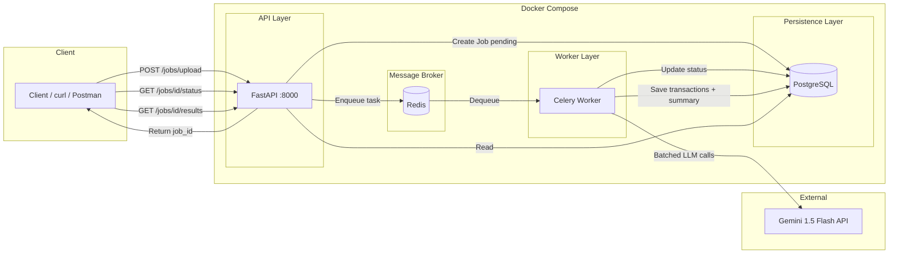
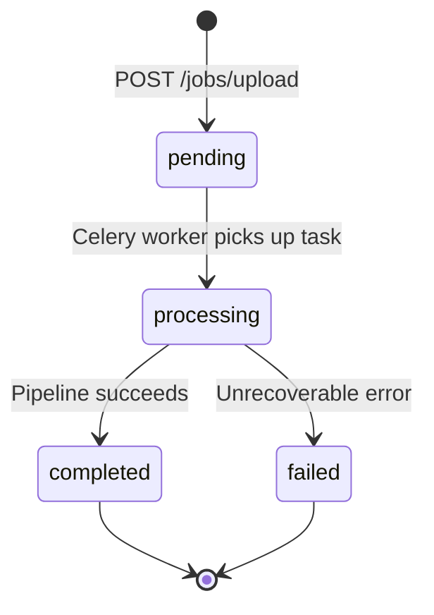

# AI-Powered Transaction Processing Pipeline

A production-style backend service that ingests dirty financial transaction CSVs, processes them asynchronously through a job queue, applies rule-based anomaly detection and LLM-powered classification, and exposes structured results via a REST polling API.

Built for the **Backend + DevOps Internship Assignment** — fully containerised, single-command startup, no manual setup required.

---

## Table of Contents

- [Architecture](#architecture)
- [State Management](#state-management)
- [Tech Stack](#tech-stack)
- [Deployment](#deployment)
- [Quick Start (Local)](#quick-start-local)
- [API Reference](#api-reference)
- [Processing Pipeline](#processing-pipeline)
- [Database Schema](#database-schema)
- [Environment Variables](#environment-variables)
- [Project Structure](#project-structure)
- [CI/CD](#cicd)
- [Submission Links](#submission-links)

---

## Architecture

This project follows a **layered, event-driven async architecture** — commonly used in data-processing and ETL pipelines.

| Pattern | How it is applied |
|---------|-------------------|
| **Layered architecture** | API layer → service layer → persistence layer, with clear separation of concerns |
| **Async task queue** | Long-running CSV processing is offloaded to Celery workers via Redis |
| **Polling API** | Client receives `job_id` immediately; polls `/status` until processing completes |
| **Repository pattern** | SQLAlchemy ORM models abstract PostgreSQL access |
| **Graceful degradation** | LLM failures are isolated per batch; jobs still complete with heuristic fallback |

### High-Level System Diagram



### Request Lifecycle

```
1. Client uploads CSV
       ↓
2. FastAPI validates file → creates Job (status: pending) in PostgreSQL
       ↓
3. Celery task enqueued in Redis → API returns job_id immediately (HTTP 202)
       ↓
4. Worker picks up task → sets status: processing
       ↓
5. Pipeline runs: Clean → Anomaly detect → LLM classify → LLM summary
       ↓
6. Worker persists Transaction rows + JobSummary → sets status: completed
       ↓
7. Client polls GET /jobs/{id}/status until completed
       ↓
8. Client fetches GET /jobs/{id}/results for full output
```

### Why these choices?

| Decision | Rationale |
|----------|-----------|
| **FastAPI** | Async-native, automatic OpenAPI docs, fast validation with Pydantic |
| **Celery + Redis** | Industry-standard background job processing; decouples API from heavy work |
| **PostgreSQL** | Relational storage for jobs, transactions, and structured summaries |
| **Docker Compose** | One-command reproducible environment for reviewers and CI |
| **Batched LLM calls** | Avoids N+1 API calls; reduces latency and rate-limit risk |
| **Polling over WebSockets** | Simpler for assignment scope; stateless and easy to test with curl |

---

## State Management

Job progress is managed through a **finite state machine (FSM)** persisted in PostgreSQL. There is no in-memory or client-side state — the database is the single source of truth.

### Job State Machine



| State | Description | Set by |
|-------|-------------|--------|
| `pending` | Job created, task queued in Redis | FastAPI on upload |
| `processing` | Worker is running the pipeline | Celery worker |
| `completed` | Transactions + summary saved | Celery worker |
| `failed` | Pipeline crashed; `error_message` populated | Celery worker |

### What is stored at each stage

| Stage | PostgreSQL tables updated |
|-------|---------------------------|
| Upload | `jobs` — `status=pending`, `row_count_raw`, `created_at` |
| Processing | `jobs.status=processing` |
| Complete | `transactions` (all cleaned rows), `job_summaries`, `jobs.status=completed`, `row_count_clean`, `completed_at` |
| Failed | `jobs.status=failed`, `error_message`, `completed_at` |

### Per-transaction flags

| Field | Purpose |
|-------|---------|
| `is_anomaly` / `anomaly_reason` | Rule-based anomaly detection result |
| `llm_category` | Category assigned by LLM (if applicable) |
| `llm_failed` | `true` if LLM call failed after retries; heuristic fallback used |

Clients **never** push state — they only read it via `GET /jobs/{id}/status` and `GET /jobs/{id}/results`.

---

## Tech Stack

| Layer | Technology |
|-------|------------|
| API | FastAPI 0.115 |
| Runtime | Python 3.12 |
| Database | PostgreSQL 16 |
| ORM | SQLAlchemy 2.0 |
| Task queue | Celery 5.4 + Redis 7 |
| LLM | Google Gemini 1.5 Flash |
| Containerisation | Docker + Docker Compose |
| CI | GitHub Actions |

---

## Deployment

### Recommended: Local / Reviewer evaluation (assignment default)

The assignment requires the entire stack to start with one command. **Docker Compose is the primary deployment target.**

```bash
docker compose up --build
```

Services exposed:

| Service | URL / Port |
|---------|------------|
| API | http://localhost:8000 |
| Swagger docs | http://localhost:8000/docs |
| PostgreSQL | localhost:5432 |
| Redis | localhost:6379 |

---

### Production deployment options

For a real production deployment beyond the assignment, this architecture maps cleanly to cloud platforms:

| Platform | What to deploy | Notes |
|----------|----------------|-------|
| **Railway / Render / Fly.io** | API container + Worker container + managed Postgres + managed Redis | Easiest path; push Docker images from GitHub |
| **AWS ECS / Fargate** | API task + Worker task + RDS PostgreSQL + ElastiCache Redis | Best for scale; more setup |
| **Google Cloud Run + Cloud SQL** | API as service; Worker as Cloud Run job or GCE | Good if using Gemini in same GCP project |
| **Kubernetes (EKS/GKE)** | Deployments for api/worker; StatefulSet or managed DB | Enterprise-grade; overkill for assignment |

#### Suggested production topology

```
                    ┌─────────────┐
   Internet ──────► │  Load       │
                    │  Balancer   │
                    └──────┬──────┘
                           │
                    ┌──────▼──────┐
                    │  FastAPI    │  (horizontally scaled)
                    │  replicas   │
                    └──────┬──────┘
                           │
              ┌────────────┼────────────┐
              │            │            │
       ┌──────▼──────┐ ┌───▼───┐ ┌─────▼─────┐
       │  PostgreSQL │ │ Redis │ │  Celery   │
       │  (RDS)      │ │       │ │  Workers  │
       └─────────────┘ └───────┘ └───────────┘
                                        │
                                 ┌──────▼──────┐
                                 │ Gemini API  │
                                 └─────────────┘
```

> **Note:** For the internship submission, reviewers clone the repo and run `docker compose up`. A live cloud deployment is **not required** unless explicitly asked.

---

## Quick Start (Local)

### Prerequisites

- Docker Desktop (with Docker Compose v2)
- Git

### Steps

```bash
# 1. Clone the repository
git clone https://github.com/YOUR_USERNAME/YOUR_REPO.git
cd YOUR_REPO

# 2. (Optional) Enable live Gemini LLM calls
cp .env.example .env
# Add your key: GEMINI_API_KEY=your_key_here

# 3. Start all services
docker compose up --build
```

### Verify

```bash
curl http://localhost:8000/health
# Expected: {"status":"ok"}
```

---

## API Reference

| Method | Endpoint | Description |
|--------|----------|-------------|
| `POST` | `/jobs/upload` | Upload CSV; returns `job_id` immediately |
| `GET` | `/jobs/{job_id}/status` | Poll job status; includes summary when completed |
| `GET` | `/jobs/{job_id}/results` | Full results (transactions, anomalies, breakdown, narrative) |
| `GET` | `/jobs?status=` | List all jobs; optional filter by status |
| `GET` | `/health` | Health check |

Interactive docs: **http://localhost:8000/docs**

### Example: Full workflow

```bash
# Upload
curl -X POST "http://localhost:8000/jobs/upload" \
  -F "file=@transactions.csv"

# Poll status (replace JOB_ID)
curl "http://localhost:8000/jobs/JOB_ID/status"

# Fetch results
curl "http://localhost:8000/jobs/JOB_ID/results"

# List completed jobs
curl "http://localhost:8000/jobs?status=completed"
```

### Upload response

```json
{
  "job_id": "550e8400-e29b-41d4-a716-446655440000",
  "status": "pending",
  "message": "Job enqueued for processing"
}
```

### Completed status response (includes summary)

```json
{
  "job_id": "550e8400-e29b-41d4-a716-446655440000",
  "status": "completed",
  "filename": "transactions.csv",
  "row_count_raw": 95,
  "row_count_clean": 85,
  "summary": {
    "total_spend_inr": 1339923.0,
    "total_spend_usd": 74185.14,
    "anomaly_count": 5,
    "risk_level": "high"
  }
}
```

---

## Processing Pipeline

When a Celery worker dequeues a job, it executes these steps **in order**:

| Step | Module | Description |
|------|--------|-------------|
| 1. Data cleaning | `services/cleaning.py` | Normalise dates to ISO 8601; strip `$` from amounts; uppercase status/currency; remove exact duplicate rows; mark rows needing LLM category |
| 2. Anomaly detection | `services/anomaly.py` | Flag amount > 3× account median; flag USD at domestic merchants (Swiggy, Ola, IRCTC) |
| 3. LLM classification | `services/llm.py` | Batched category assignment for uncategorised rows; 3 retries with exponential backoff |
| 4. LLM narrative | `services/llm.py` | Single call producing JSON summary with spend totals, top merchants, risk level |
| 5. Persistence | `tasks/pipeline.py` | Write all results to PostgreSQL; mark job completed |

**Failure handling:** If LLM calls fail after retries, affected rows are marked `llm_failed=true` and heuristic fallback is used. The job still completes — it does not fail entirely.

---

## Database Schema

```
┌─────────────────────────────────────────────────────────┐
│ jobs                                                    │
├─────────────────────────────────────────────────────────┤
│ id (UUID PK)  filename  status  row_count_raw           │
│ row_count_clean  created_at  completed_at  error_message│
└──────────────────────────┬──────────────────────────────┘
                           │ 1:N
              ┌────────────▼────────────┐
              │ transactions            │
              ├─────────────────────────┤
              │ txn_id  date  merchant  amount  currency    │
              │ status  category  account_id  notes         │
              │ is_anomaly  anomaly_reason                  │
              │ llm_category  llm_failed  llm_raw_response  │
              └─────────────────────────┘
                           │ 1:1
              ┌────────────▼────────────┐
              │ job_summaries           │
              ├─────────────────────────┤
              │ total_spend_inr  total_spend_usd           │
              │ top_merchants (JSON)  anomaly_count         │
              │ narrative  risk_level                     │
              └─────────────────────────┘
```

---

## Environment Variables

| Variable | Default | Required | Description |
|----------|---------|----------|-------------|
| `DATABASE_URL` | `postgresql://postgres:postgres@db:5432/transactions` | Yes | PostgreSQL connection string |
| `REDIS_URL` | `redis://redis:6379/0` | Yes | Celery broker and result backend |
| `GEMINI_API_KEY` | _(empty)_ | No | Google AI API key; without it, heuristic fallback is used |

Copy `.env.example` to `.env` for local overrides. **Never commit `.env` to Git.**

---

## Project Structure

```
.
├── app/
│   ├── api/
│   │   └── jobs.py           # REST endpoints
│   ├── services/
│   │   ├── cleaning.py       # CSV parsing and normalisation
│   │   ├── anomaly.py        # Statistical and rule-based flags
│   │   └── llm.py            # Gemini integration + fallbacks
│   ├── tasks/
│   │   └── pipeline.py       # Celery background task
│   ├── models.py             # SQLAlchemy ORM models
│   ├── schemas.py            # Pydantic request/response models
│   ├── database.py           # DB engine and session
│   ├── celery_app.py         # Celery configuration
│   ├── config.py             # Settings from environment
│   └── main.py               # FastAPI application entrypoint
├── .github/workflows/ci.yml  # Automated Docker + API tests
├── docker-compose.yml        # Full stack orchestration
├── Dockerfile
├── requirements.txt
├── transactions.csv          # Sample dataset (~90 rows)
└── README.md
```

---

## CI/CD

GitHub Actions runs on every push to `main`:

1. `docker compose up --build -d`
2. Health check on `/health`
3. Upload `transactions.csv` → poll until `completed` → verify results

View pipeline status in the **Actions** tab of the repository.

---

## Submission Links

| Deliverable | Link |
|-------------|------|
| GitHub repository | `https://github.com/YOUR_USERNAME/YOUR_REPO` |
| Architecture diagram (draw.io) | _Add your public link here_ |
| 3-minute technical video | _Add your Loom/YouTube link here_ |

---

## Scale Considerations

At **100× traffic**, the current design would bottleneck at:

| Bottleneck | Mitigation |
|------------|------------|
| Single Celery worker | Scale worker replicas horizontally |
| PostgreSQL connection pool | Add PgBouncer; increase pool size |
| Redis queue backlog | Multiple workers; priority queues |
| LLM API rate limits | Larger batches; request queuing; caching by merchant |
| Synchronous CSV parsing in worker | Stream parsing; chunk jobs by row count |

---

## License

Submitted as part of an internship assignment. All rights reserved by the author.
